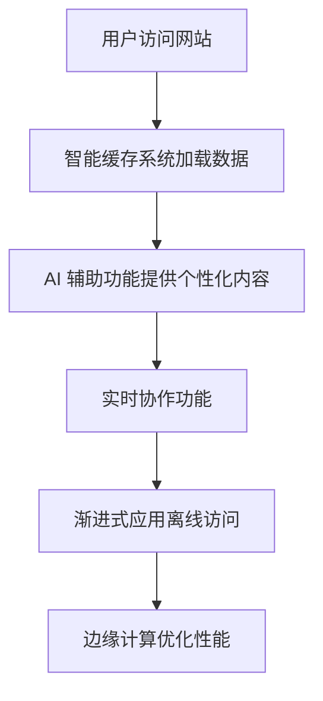

# 无后端网站改进能力 - 产品需求文档

## 1. Product Overview
无后端网站改进项目旨在通过前沿技术提升无后端网站的功能和性能，实现更丰富的用户体验。
- 主要解决无后端网站功能受限的问题，为用户提供更完整、更智能的网站体验
- 目标用户为前端开发者和网站所有者，市场价值在于降低开发成本同时提升网站质量

## 2. Core Features

### 2.1 User Roles
| Role | Registration Method | Core Permissions |
|------|---------------------|------------------|
| 普通用户 | 无需注册 | 浏览网站内容，使用基本功能 |
| 高级用户 | 浏览器本地存储 | 访问个人化功能，保存偏好设置 |

### 2.2 Feature Module
1. **智能缓存系统**：本地数据存储，离线访问能力
2. **AI 辅助功能**：基于浏览器的 AI 能力，无需后端支持
3. **实时协作**：基于 WebRTC 的点对点通信
4. **渐进式 Web (PWA)**：离线访问，推送通知
5. **边缘计算**：利用 CDN 和 Edge Functions 增强性能

### 2.3 Page Details
| Page Name | Module Name | Feature description |
|-----------|-------------|---------------------|
| 主页面 | 智能缓存系统 | 本地存储常用数据，提升加载速度，支持离线访问 |
| 主页面 | AI 辅助功能 | 基于浏览器的 AI 模型，提供智能推荐和内容生成 |
| 协作页面 | 实时协作 | 基于 WebRTC 的点对点通信，支持多人实时编辑 |
| 应用页面 | 渐进式应用 | 支持添加到主屏幕，离线访问，推送通知 |
| 性能监控 | 边缘计算 | 利用 CDN 和 Edge Functions 优化性能，减少延迟 |

## 3. Core Process
用户访问网站 → 智能缓存系统加载本地数据 → AI 辅助功能提供个性化内容 → 实时协作功能支持多人互动 → 渐进式应用提供离线访问能力 → 边缘计算优化性能

## 4. User Interface Design
### 4.1 Design Style
- 主色调：深蓝色 (#165DFF) 和浅灰色 (#F5F7FA)
- 按钮风格：圆角设计，悬停效果
- 字体：Inter 无衬线字体，标题 24px，正文 16px
- 布局风格：卡片式布局，响应式设计
- 图标风格：线性图标，简洁现代

### 4.2 Page Design Overview
| Page Name | Module Name | UI Elements |
|-----------|-------------|-------------|
| 主页面 | 智能缓存系统 | 加载状态指示器，缓存状态显示，离线模式提示 |
| 主页面 | AI 辅助功能 | 智能推荐卡片，内容生成按钮，AI 交互界面 |
| 协作页面 | 实时协作 | 多人光标指示，实时编辑状态，协作成员列表 |
| 应用页面 | 渐进式应用 | 添加到主屏幕提示，离线状态指示器，推送通知设置 |
| 性能监控 | 边缘计算 | 性能指标仪表盘，加载时间可视化，CDN 状态显示 |

### 4.3 Responsiveness
- 采用移动优先设计，支持从 320px 到 1920px 的所有设备
- 关键断点：360px (手机)、768px (平板)、1200px (桌面)
- 触摸优化：按钮最小尺寸 44x44px，支持触摸手势

### 4.4 3D Scene Guidance
- 环境：简约现代的 3D 背景，轻度视差效果
- 光照：柔和的环境光，强调主题元素
- 相机：固定视角，轻微的交互响应
- 构图：中心聚焦，辅助元素环绕
- 交互：鼠标悬停时的细微动画效果
- 后处理：轻微的景深效果，提升视觉层次感
- 资源：使用轻量级 3D 模型，确保性能流畅